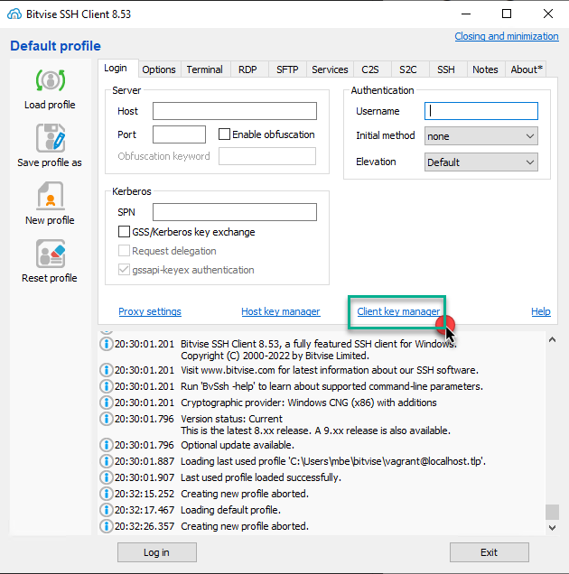
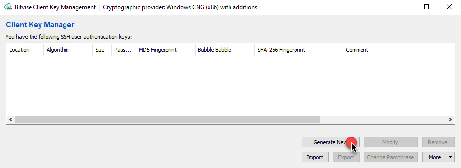
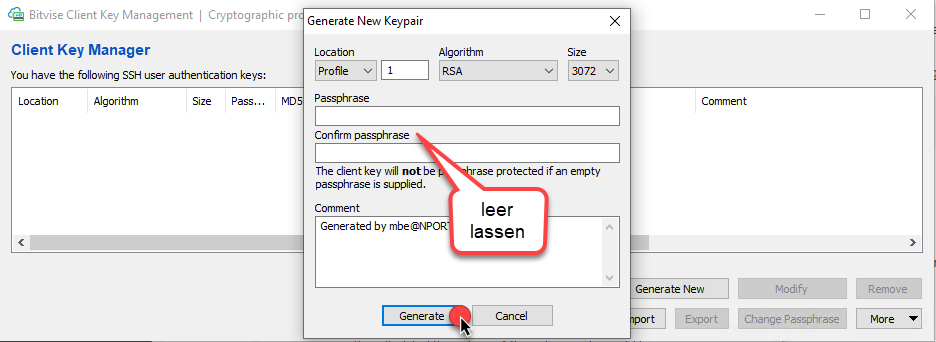
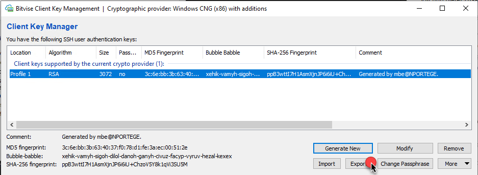
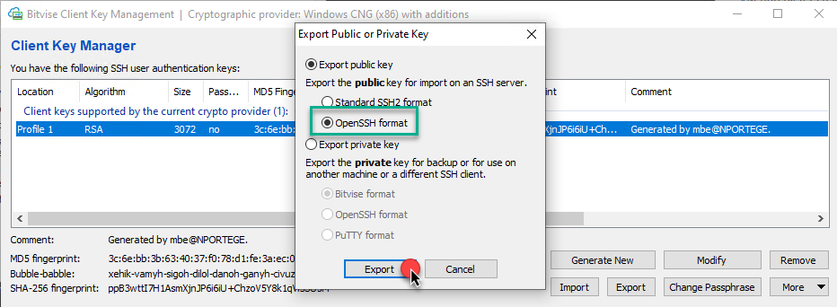
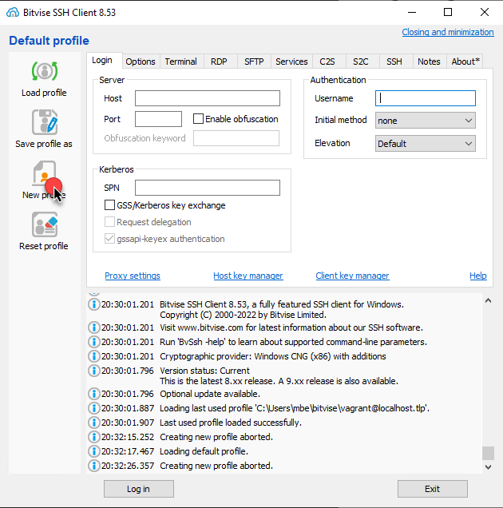
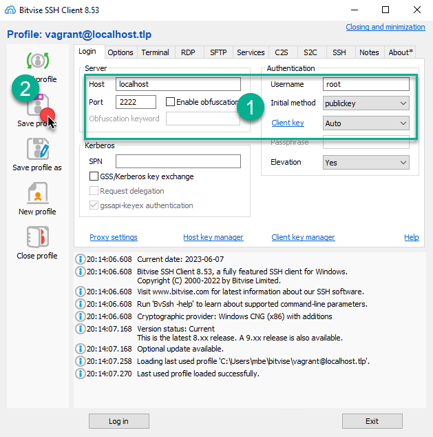

[2]: https://www.bitvise.com/ssh-client-download "Bitvise SSH/SFTP Client"

# Bitvise SSH-Client

- [Bitvise SSH-Client](#bitvise-ssh-client)
  - [Bitvise SSH-Client installieren](#bitvise-ssh-client-installieren)
  - [SSH-Key Pair einrichten und public Key exportieren](#ssh-key-pair-einrichten-und-public-key-exportieren)
  - [*Vagrant Login* Profil erstellen](#vagrant-login-profil-erstellen)
 
---

In den folgenden Abschnitten richten wir einen grafischen SSH/SFTP Client ein. Wir verwenden dazu den *opensource* [Bitvise][2] Client. Der Client ermöglicht einen einfachen Zugang zur Linux-VM und ermöglicht es, Files zwischen Windows und Linux zu transferieren. 

---

## Bitvise SSH-Client installieren

Laden sie den Installer von [Bitvise][2] und führen das Setup mit den standard Vorgaben durch.

---

## SSH-Key Pair einrichten und public Key exportieren

Nachdem der Client installiert ist, erstellen sie ein SSH-Key Pair. Dieser wird für den passwortfreien Login auf die Linux-VM benötigt.

> Das SSH-Key Pair wird unabhängig von den bereits erstellten Keys gespeichert.  
> Wir verwenden diese ausschliesslich zum Einloggen auf der Vagrant-VM.

Auf `Client key manager` Klicken

 

und anschliessend `Generate New` anklicken.

 

Wie bereits beim SSH-Key Pair, welches wir unter der *GIT Bash* erstellt hatten, lassen wir das Passwort für den Key frei.

Ein *RSA* Key wurde nun unter dem *Profile 1* erstellt. Aus diesem exportieren wir im nächsten Schritt einen *OpenSSH public Key* und speichern diesen ab. 

> Der *public Key* kann jederzeit erneut aus dem *privat Key* exportiert werden.

 

---

## *Vagrant Login* Profil erstellen

Nun können wir ein neues Profil zum Verbinden auf unsere Vagrant-VM erstellen. Dazu klicken wir `New profile` an

 

1. die Felder im grünen Rahmen wie dargestellt ausfüllen
2. Das Profil abspeichern um es später wieder verwenden können

 

> **Anmerkung:** Vagrant erstellt beim Starten automatisch ein Port-Weiterleitung vom **SSH Port 22 auf Port 2222.** 
> Laufen gleichzeitig mehrere Vagrant VMs, so wählt Vagrant einen *alternativen* freien Port.

  
Weiter gehts [hier](README.md)

 