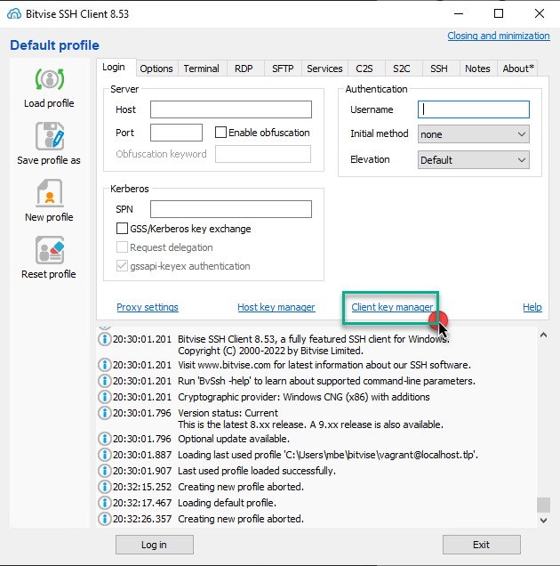
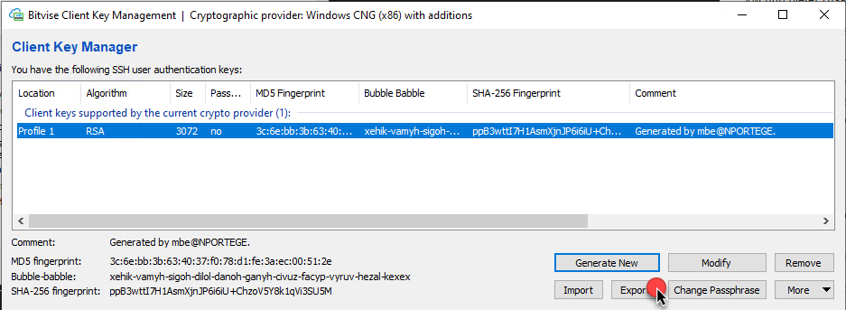

[1]: https://www.tuxcademy.org/download/de/adm1/adm1-de-manual.pdf "Tux Academy"
[2]: https://www.bitvise.com/ssh-client-download "Bitvise SSH/SFTP Client"

# Vagrant VM mit Docker

## Umgebung

Vagrant VM mit Docker. Die VM kann als Basis für Docker Konfigurationen eingesetzt werden. 

### VM Eigenschaften

* Ubuntu Jammy 64
* 2 GB Memory
* User - vagrant

### Personalisieren

Im File `scripts\add_ssh_pub.sh` können sie ihre persönlichen Public-Keys hinterlegen. Diesen tragen sie einfach wie unten dargestellt zwischen den Hochkommas `' ... '` ein. Dabei verwenden sie ihren eigenen *public_key*.

```
#!/bin/sh

# hier den eigenen public-key eintragen
public_key='ssh-rsa AAAAB3NzaC1yc2EAAAADAQABAAABgQCxfc7YGRM0qDgkAFwwdrExJK9JUrZeypX+4wUAMdAIkbZ0bCclzV5Kpg9ZON7qlulhyEsRS+ZUtDZe+
ZANZhzpz4swte5ULTox9Mx3zj6PWWUXWD9RqHYnWeUEiP4OdDThuyDqlEKWvEy3u1WIxPEUiv3kjAiX2XR4MC0l5/OiJCP5ea8iXEiFI+NUzy7mCWuWW8Fp6iPX0giI4P
sD4fzBKuxC9SsdsirHOsIvMd5B8jaSdVvTa6qTj9J2bUSW6ANoSuG7J7m/3La4kJKjGBr7tsuELj5z0QSoEybZsU6KxWlDQwGGDV6OSQ8swfLFoJu7jckRupkBWHspuBk
+plpPmCt8Ean37MbCXNGk72sg+C8Qe1O3MzeDMTYrISssJD/UEkiJgJXpy97V5I9Cqfs3WNf7YZSErzKYAFjEjsishWu+ydveETfsMB+I/ledgu/gX/+Af5ZiyGApMTF+
ot9TzR3A0ojHHaEhJVOhTkgWu0aK+2rbtPwYEfEQMZYQiN0= Generated by vagrant '

# add public key for usr vagrant
echo $public_key >> /home/vagrant/.ssh/authorized_keys

# add public key for root
chmod 700 /root/.ssh
echo $public_key >> /root/.ssh/authorized_keys && chmod 600 /root/.ssh/authorized_keys
```


> **WICHTIG:** Den *public_key* müssen sie eintragen **bevor** sie die VM mit `vagrant up` starten 

### Netzwerk

Die TCP-Portweiterleitung der VM ist wie folgt konfiguriert. Die Weiterleitung kann ebenfalls in den Einstellungen der VirtualBox eingesehen werden.

  |Verwendung| Host| VM | 
  |:--:|:--:|:--:|
  |ssh| 2222| 22 |
  |Web|8082|8082|

# Übungen

## Umgebung einrichten

Ziel ist es, die Umgebung so "bequem" wie möglich einzurichten. Dazu zählt insbesondere, dass wir auf einfach Art in die *Linux-VM* einloggen und dort Files erstellen und modifizieren können. Im Folgenden wird deshalb ein Weg (von vielen) aufgezeigt, wie von einem Windows-System in einer Linux-VM gearbeitet werden kann. Natürlich ersetzt das nicht die grundlegenden Linux Kenntnisse, aber es erleichtert zumindest die Arbeit. Gute Hilfestellungen zu Linux finden sie auf der [Tux Academy][1].

### VM starten

1) Starten sie die VM mit `vagrant up`
2) Testen sie die VM, indem sie sich mit `vagrant ssh` einloggen
   1) mit `sudo su -` auf den *root* Account switchen
   2) mit `docker ps` prüfen, ob die Docker Umgebung läuft. Ist alles gut, sieht der Output wie folgt aus:

```
root@docker:/mnt/phpmyadmin# docker ps
CONTAINER ID   IMAGE     COMMAND   CREATED   STATUS    PORTS     NAMES
```
3) mit `exit` und nochmals `exit` verlassen sie die VM wieder und sind somit wieder auf dem *Windows* System.


## SSH-Client

In den folgenden Abschnitten richten wir einen grafischen SSH/SFTP Client ein. Wir verwenden dazu den *opensource* [Bitvise][2] Client. Der Client ermöglicht einen einfachen Zugang zur Linux-VM und bietet zusätzlich die Möglichkeit, Files mit Hilfe des grafischen FTPS-Clients zwischen Windows und Linux zu transferieren. 

Wir führen folgende Schritte aus:

1. Client Installieren
2. SSH-Key Pair einrichten 
3. OpenSSH Public Key exportieren
4. Profile für *Vagrant Login* erstellen
5. SSH-Session auf Linux-VM öffnen

### SSH-Key Pair einrichten

Nachdem der Client installiert ist, erstellen sie als Erstes ein SSH-Key Pair

> Das SSH-Key Pair wird unabhängig von den bereits erstellten Keys gespeichert. <br>
> Wir verwenden diese ausschliesslich zum Einloggen auf der Vagrant-VM.



Auf `Client key manager` Klicken

 

und anschliessend `Generate New` anklicken.

 

Wie bereits beim SSH-Key Pair, welches wir unter der *GIT Bash* erstellt hatten, lassen wir das Passwort für den Key frei.



Ein *RSA* Key wurde nun unter dem *Profile 1* erstellt. Aus diesem exportieren wir im nächsten Schritt einen *OpenSSH public Key* und speichern diesen ab. 

> Der *public Key* kann jederzeit erneut aus dem *privat Key* exportiert werden.

 

Nachdem nun die SSH-Key erstellt sind, können wir ein neues Profil zum Verbinden auf unsere Vagrant-VM erstellen. Dazu klicken wir `New profile` an

 

1. die Felder im grünen Rahmen wie dargestellt ausfüllen
2. Das Profil abspeichern damit sie es später wieder verwenden können
3. Nun können wir mit `Log in` die SSH Verbindung zur Vagrant-VM starten

> Anmerkung: Vagrant erstellt beim Starten automatisch ein Portforwarding vom SSH Port 22 auf Port 2222. <br>
> Laufen gleichzeitig mehrere Vagrant VMs, so wählt Vagrant entsprechend den nächsthöheren Port.


> Sie können den verwendeten Port mit dem Kommando `vagrant port` ermitteln

```
$ vagrant port
The forwarded ports for the machine are listed below. Please note that
these values may differ from values configured in the Vagrantfile if the
provider supports automatic port collision detection and resolution.

    22 (guest) => 2222 (host)
  8082 (guest) => 8082 (host)
```

 

Nachdem Verbinden öffnet sich ein *ssh* und *ftps* Fenster. 

> Unter `Options` können sie einstellen ob automatisch *ssh* und *ftps* Fenster gestartet werden.

Sie können nun auch weitere *ssh* oder *ftps* Fenster öffnen.

 

Sie sind nun unter dem User *root* auf der Linux VM eingeloggt. 

 


## Docker

### Anwendung *phpMyAdmin*

Wir starten nun unsere erste Container Basierte Applikation in der Linux-VM. Diese besteht aus zwei Container mit folgenden Applikationen:

* MySQL Datenbank
* phpMyAdmin

Zum Starten der Container führen sie folgende Kommandos aus:

**MySQL**

` docker run -d --name db -v /tmp/data/mysql:/var/lib/mysql -e MYSQL_ROOT_PASSWORD='top-secret' mysql:5.7`

**phpMyAdmin**

`docker run -d --link db --name webserver -p 8082:80 phpmyadmin/phpmyadmin`

Nun können sie mit dem `docker ps` Kommando überprüfen, ob die beiden Container gestartet wurden. Sie sollten einen Output in der Art wie untenstehendn sehen:

```
root@docker:/mnt/phpmyadmin# docker ps
CONTAINER ID   IMAGE                   COMMAND                  CREATED          STATUS          PORTS                                   NAMES
630946b8e250   phpmyadmin/phpmyadmin   "/docker-entrypoint.…"   11 minutes ago   Up 11 minutes   0.0.0.0:8082->80/tcp, :::8082->80/tcp   webserver
8f5526028d72   mysql:5.7               "docker-entrypoint.s…"   12 minutes ago   Up 12 minutes   3306/tcp, 33060/tcp                     db
```

Alles klar? Gratuliere - sie haben erfolgreich eine auf Container basierende Applikation erstellt.

Sie können nun unter [localhost:8082](localhost:8082) auf die Applikation zugreifen und mit **root** und Passwort **top-secret** einloggen.

## Aufräumen

Führen sie einfach `vagrant destroy -f ` aus und die ganze Installation ist wieder weg. Sie wissen ja nun, wie schnell und einfach sie alles wieder erstellt haben :-)

## Zusammenfassung

Wenn sie alle Schritte erfolgreich durchgeführt haben, verfügen sie nun über eine funktionierende, mit ihrem *ssh public Key* personalisierter Docker-Container Umgebung, die auf **IaC** basiert. Das heisst, sie können die Umgebung jederzeit wieder neu erstellen.

Die verwendeten Docker Befehle werden zu einem späteren Zeitpunkt erläutert.


  


