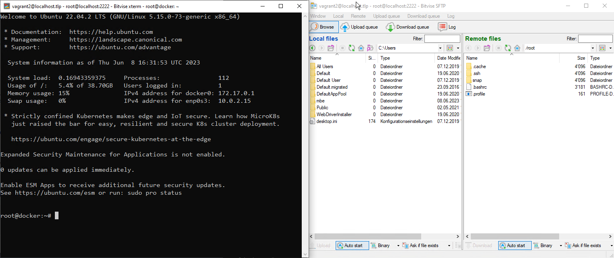

[1]: https://www.tuxcademy.org/download/de/adm1/adm1-de-manual.pdf "Tux Academy"
[2]: https://www.bitvise.com/ssh-client-download "Bitvise SSH/SFTP Client"

# Vagrant VM mit Docker

- [Vagrant VM mit Docker](#vagrant-vm-mit-docker)
  - [IaC Umgebung](#iac-umgebung)
    - [VM Eigenschaften](#vm-eigenschaften)
    - [Netzwerk Konfiguration](#netzwerk-konfiguration)
  - [SSH Client vorbereiten](#ssh-client-vorbereiten)
    - [IaC personalisieren](#iac-personalisieren)
  - [Umgebung einrichten](#umgebung-einrichten)
    - [VM starten](#vm-starten)
    - [Einloggen it dem SSH-Client](#einloggen-it-dem-ssh-client)
- [Übungen](#übungen)
  - [Docker](#docker)
    - [Anwendung *phpMyAdmin*](#anwendung-phpmyadmin)
  - [Cleanup](#cleanup)
  - [Zusammenfassung](#zusammenfassung)
  

## IaC Umgebung

Im folgenden erstellen wir eine Vagrant-VM mit einer installierten Docker Runtime Umgebung. Die VM kann als Basis für die **Docker-Konfigurationen der LB2** eingesetzt werden. 

### VM Eigenschaften

* Ubuntu Jammy 64
* 2 GB Memory
* User - vagrant
* Vorbereitet SSH-Logins für *root*
* Shared `/mnt` Verzeichnis 

### Netzwerk Konfiguration

Die TCP-Portweiterleitung der VM ist wie folgt konfiguriert. Die Weiterleitung kann ebenfalls in den Einstellungen der VirtualBox eingesehen werden.

  |Verwendung| Host| VM | 
  |:--:|:--:|:--:|
  |ssh| 2222| 22 |
  |Web|8082|8082|

## SSH Client vorbereiten

Installieren und konfigurieren sie den [SSH Bitvise][2] Client anhand [dieser Anleitung](Bitvise.md).

Nachdem sie den *SSH-Client* konfiguriert haben, geht es im Kapitel [Personalisieren](#personalisieren) weiter.


### IaC personalisieren

Im File `scripts\add_ssh_pub.sh` können sie ihre persönlichen Public-Keys hinterlegen. Diesen tragen sie einfach wie unten dargestellt zwischen den Hochkommas `' ... '` ein. Dabei verwenden sie ihren eigenen *public_key*.

> Ihren **Public-Key** haben sie im im Schritt [Vorbereitung](#vorbereitung) erstellt.

```
#!/bin/sh

# hier den eigenen public-key eintragen
public_key='ssh-rsa AAAAB3NzaC1yc2EAAAADAQABAAABgQCxfc7YGRM0qDgkAFwwdrExJK9JUrZeypX+4wUAMdAIkbZ0bCclzV5Kpg9ZON7qlulhyEsRS+ZUtDZe+
ZANZhzpz4swte5ULTox9Mx3zj6PWWUXWD9RqHYnWeUEiP4OdDThuyDqlEKWvEy3u1WIxPEUiv3kjAiX2XR4MC0l5/OiJCP5ea8iXEiFI+NUzy7mCWuWW8Fp6iPX0giI4P
sD4fzBKuxC9SsdsirHOsIvMd5B8jaSdVvTa6qTj9J2bUSW6ANoSuG7J7m/3La4kJKjGBr7tsuELj5z0QSoEybZsU6KxWlDQwGGDV6OSQ8swfLFoJu7jckRupkBWHspuBk
+plpPmCt8Ean37MbCXNGk72sg+C8Qe1O3MzeDMTYrISssJD/UEkiJgJXpy97V5I9Cqfs3WNf7YZSErzKYAFjEjsishWu+ydveETfsMB+I/ledgu/gX/+Af5ZiyGApMTF+
ot9TzR3A0ojHHaEhJVOhTkgWu0aK+2rbtPwYEfEQMZYQiN0= Generated by vagrant '

# add public key for usr vagrant
echo $public_key >> /home/vagrant/.ssh/authorized_keys

# add public key for root
chmod 700 /root/.ssh
echo $public_key >> /root/.ssh/authorized_keys && chmod 600 /root/.ssh/authorized_keys
```


> **WICHTIG:** Den *Public_key* müssen sie eintragen, **bevor** sie die VM mit `vagrant up` starten 

<br>

## Umgebung einrichten

Das Ziel ist es, die Umgebung so "bequem" wie möglich einzurichten. Dazu zählt insbesondere, dass wir auf einfach Art in die *Linux-VM* einloggen und dort Files erstellen und modifizieren können. Im Folgenden wird ein Weg (von vielen) aufgezeigt, wie "bequem" von einem Windows-System in einer Linux-VM gearbeitet werden kann. Natürlich ersetzt das nicht grundlegenden Linux Kenntnisse, aber es erleichtert zumindest die Arbeit.<br><br>Gute Hilfestellungen zu Linux finden sie auf der [Tux Academy][1].

### VM starten

1) Starten sie die VM mit `vagrant up`
2) Testen sie die VM, indem sie mit `vagrant ssh` einloggen
   1) mit `sudo su -` auf den *root* Account switchen
   2) mit `docker ps` prüfen, ob die Docker Umgebung läuft. Ist alles gut, sieht der Output wie folgt aus:

```
root@docker:~# docker ps
CONTAINER ID   IMAGE     COMMAND   CREATED   STATUS    PORTS     NAMES
```
3) Mit `exit` und nochmals `exit` verlassen sie die VM wieder und sind somit wieder auf dem *Windows* System.

<br>

---

### Einloggen it dem SSH-Client

1. Laden sie nun das vorgängig gespeicherte Profil
2. Nun können sie mit `Log in` die SSH-Verbindung zur Vagrant-VM starten

 

> **Anmerkung:** Vagrant erstellt beim Starten automatisch ein Port-Weiterleitung vom **SSH Port 22 auf Port 2222.**<br>
> Laufen gleichzeitig mehrere Vagrant VMs, so wählt Vagrant einen *alternativen* freien Port.

> Sie können den aktuell verwendeten Port mit dem Kommando `vagrant port` ermitteln.<br>Passen sie falls nötig den Port in der Bitvise Konfiguration an.

```
$ vagrant port
The forwarded ports for the machine are listed below. Please note that
these values may differ from values configured in the Vagrantfile if the
provider supports automatic port collision detection and resolution.

    22 (guest) => 2222 (host)
  8082 (guest) => 8082 (host)
```

War der das Verbinden erfolgreich, öffnen sich zwei Fenster
* Ein SSH-Terminal
* Ein Filetransfer GUI 

 

> Unter `Options` können sie einstellen, welche Fenster beim Verbinden automatisch geöffnet werden.

Sie können beliebig weitere *ssh* oder *ftps* Sessions öffnen.

 

Wenn bis zu diesem Punkt alles funktioniert hat, sind sie bestens für die weiteren Schritte mit Docker vorbereitet.

<br><br>

# Übungen

## Docker

Die folgenden Schritte erfolgen in der Vagrant-VM unter dem *root* Account. Als Docker-Einstiegsübung werden wir eine funktionierende **phpMyAdmin** Installation durchführen. Das geht ganz schnell und einfach - versprochen :-)

### Anwendung *phpMyAdmin*

Wir starten nun unsere erste Container Basierte Applikation in der Linux-VM. Diese besteht aus zwei Container mit folgenden Applikationen:

* MySQL Datenbank
* phpMyAdmin

Zum Starten der Container führen sie folgende Kommandos aus:

*MySQL*

` docker run -d --name db -v /tmp/data/mysql:/var/lib/mysql -e MYSQL_ROOT_PASSWORD='top-secret' mysql:5.7`

*phpMyAdmin*

`docker run -d --link db --name webserver -p 8082:80 phpmyadmin/phpmyadmin`

Nun können sie mit dem `docker ps` Kommando überprüfen, ob die beiden Container gestartet wurden. Sie sollten einen Output in der Art wie untenstehenden sehen:

```
root@docker:/mnt/phpmyadmin# docker ps
CONTAINER ID   IMAGE                   COMMAND                  CREATED          STATUS          PORTS                                   NAMES
630946b8e250   phpmyadmin/phpmyadmin   "/docker-entrypoint.…"   11 minutes ago   Up 11 minutes   0.0.0.0:8082->80/tcp, :::8082->80/tcp   webserver
8f5526028d72   mysql:5.7               "docker-entrypoint.s…"   12 minutes ago   Up 12 minutes   3306/tcp, 33060/tcp                     db
```

Alles klar? Gratuliere - sie haben erfolgreich eine auf Container basierende Applikation erstellt.

Sie können nun unter [localhost:8082](localhost:8082) auf die Applikation zugreifen und mit **root** und Passwort **top-secret** einloggen.

## Cleanup

Führen sie einfach `vagrant destroy -f ` aus und die ganze Installation ist wieder weg. Sie wissen ja nun, wie schnell und einfach sie alles wieder erstellt haben :-)

## Zusammenfassung

Wenn sie alle Schritte erfolgreich durchgeführt haben, verfügen sie nun über eine funktionierende, mit ihrem *ssh public Key* personalisierter Docker-Container Umgebung, die auf **IaC** basiert. Das heisst, sie können die Umgebung jederzeit wieder neu erstellen.

Die verwendeten Docker Befehle werden zu einem späteren Zeitpunkt erläutert.


  


